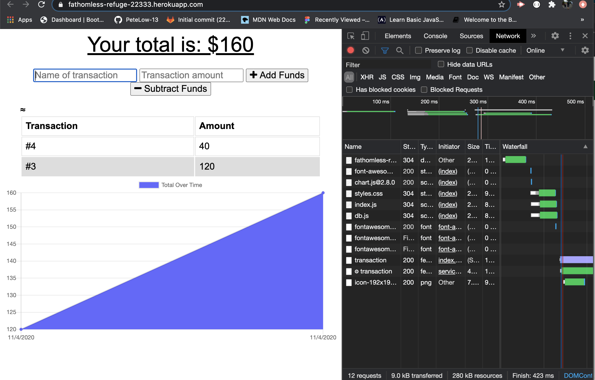
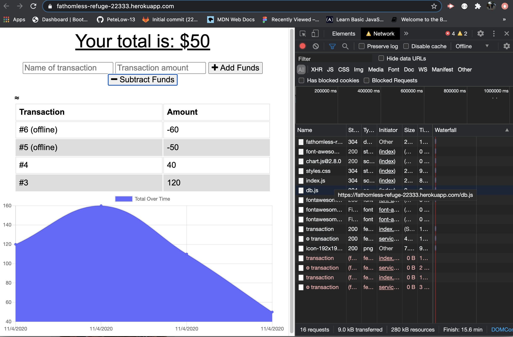
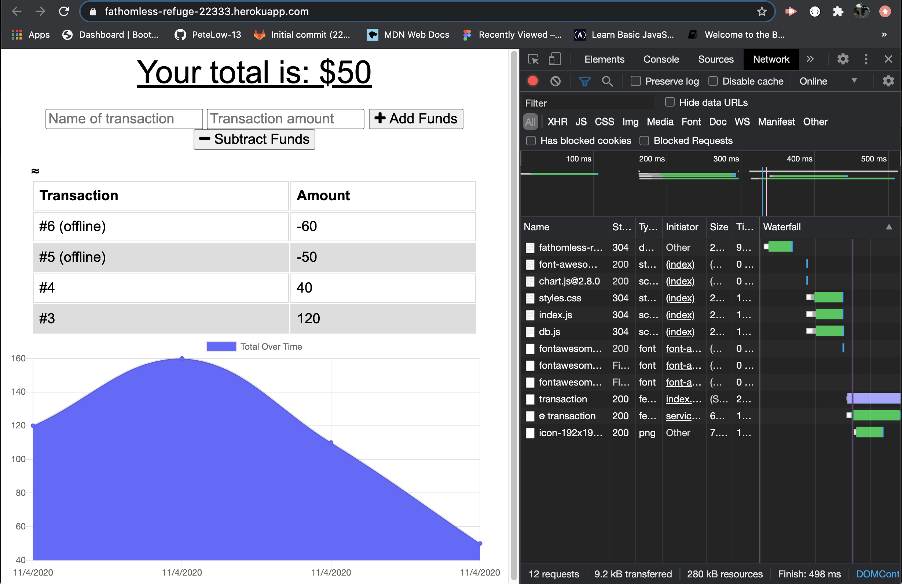

# On-Offline-Budget-Tracker

## Description

A tool to help manage your budget weather or not you are connecteed to the internet.
 
## Table of Contents
- [Usage](#usage)
- [Installation](#installation)
- [License](#license)
- [Languages](#languages)
- [Media](#media)
- [Deployed](#deployed)
- [Questions](#questions)

A tool to help manage your budget wether or not you are connecteed to the internet. 
## Usage

Use it to help budget and track incoming and out going funds.
## Installation

npm install all dependencies. App can then be run on localhost:3000. 
## License

License
## Languages

JavaScript, CSS, HTML, Express, Mongoose, Morgan, Bootstrap, lite-server, Compression
## Media

Transactions can be entered offline and will be handled by the service-worker, then pushed to the database upon reconnection

## Deployed

- https://fathomless-refuge-22333.herokuapp.com/
## Repository
- https://github.com/PeteLow-13/On-Offline-Budget-Tracker
## Questions

Contact me via email or github with questions
- pedritolow@gmail.com
- [PeteLow-13](http://github.com/PeteLow-13)
